# 📱 CryptoPulse

CryptoPulseApp is a React Native mobile application with a Python FastAPI backend that allows users to track cryptocurrency prices and receive custom notifications about their favorite coins.
The app integrates with the CoinGecko API to fetch up to 30 cryptocurrencies and provides a clean, modern interface with authentication, scheduling, and dark mode support.

[](https://www.python.org/)
[](LICENSE)

# 📸 Screenshots / Demo
<!-- Replace with actual images or video links -->

## 📱 Home Screen – Live prices and changes
<div style="display: flex; gap: 10px;">
  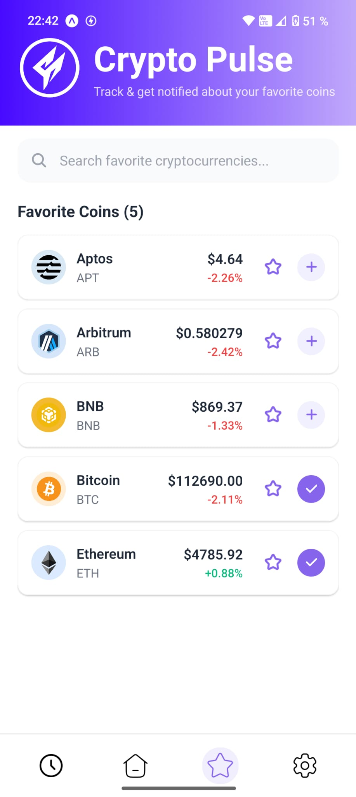
  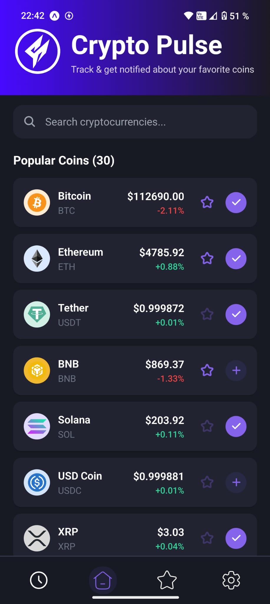
</div>

## ⭐ Favorites – Track your chosen coins
<div style="display: flex; gap: 10px;">
  
  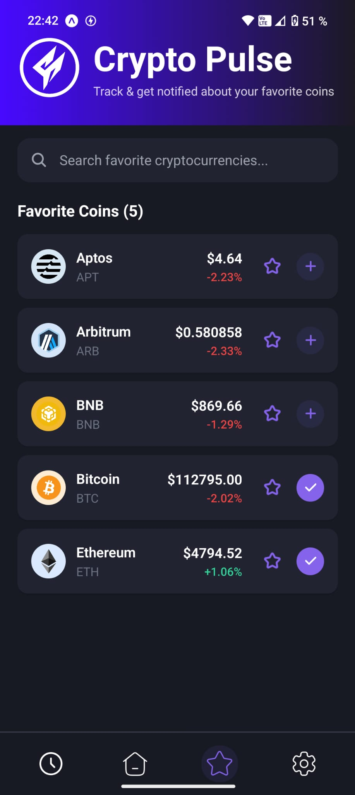
</div>

## 🔔 Notifications – Flexible scheduling
<div style="display: flex; gap: 10px;">
  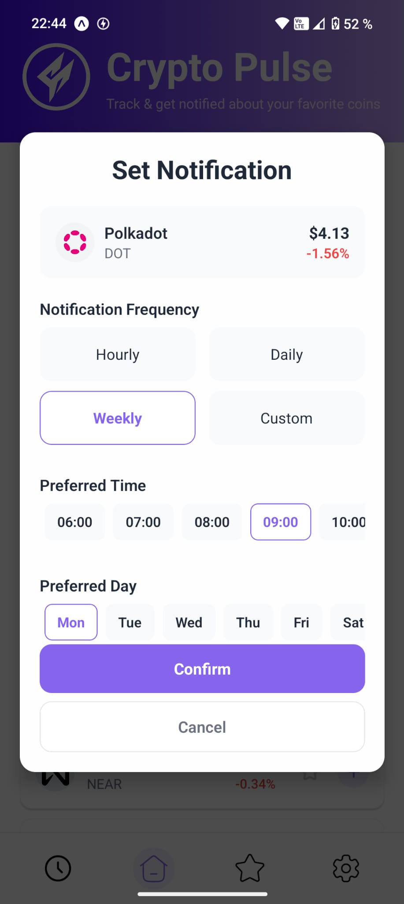
  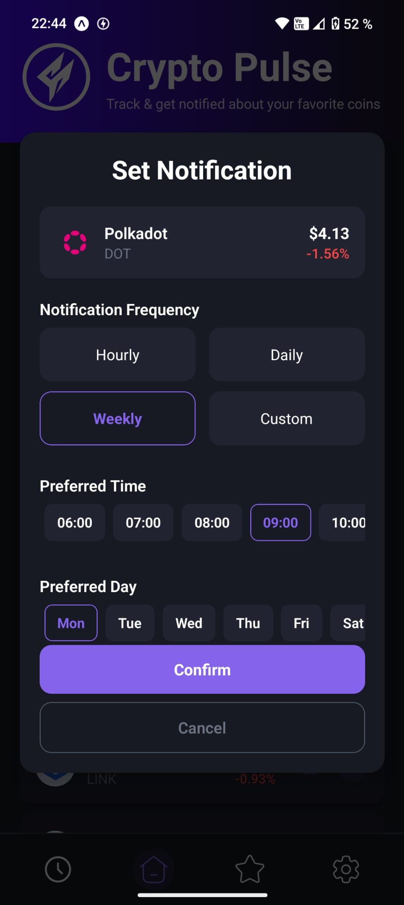
</div>

## 🕙 Logs – Modern UI experience
<div style="display: flex; gap: 10px;">
  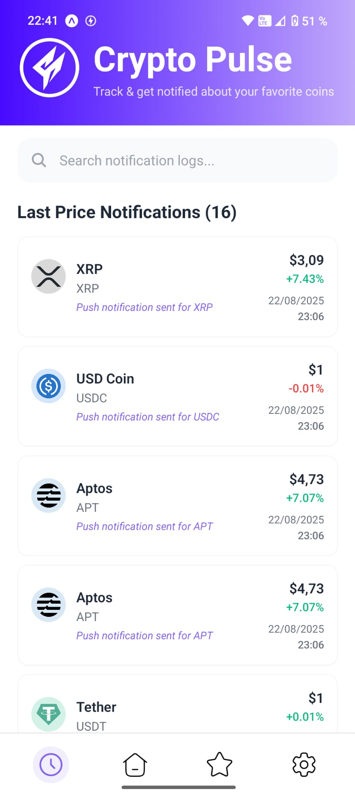
  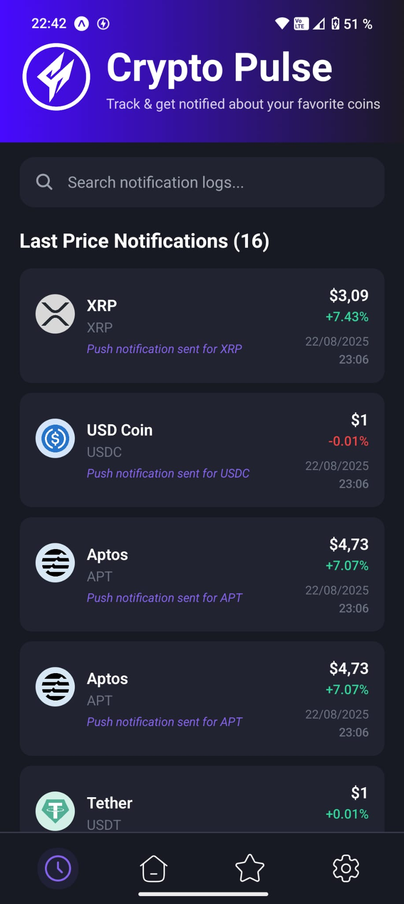
</div>

## 🛠️ Settings
<div style="display: flex; gap: 10px;">
  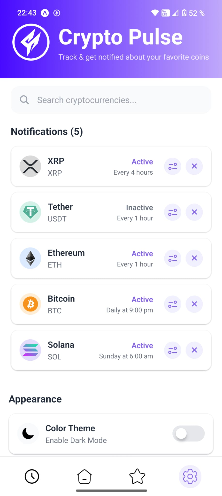
  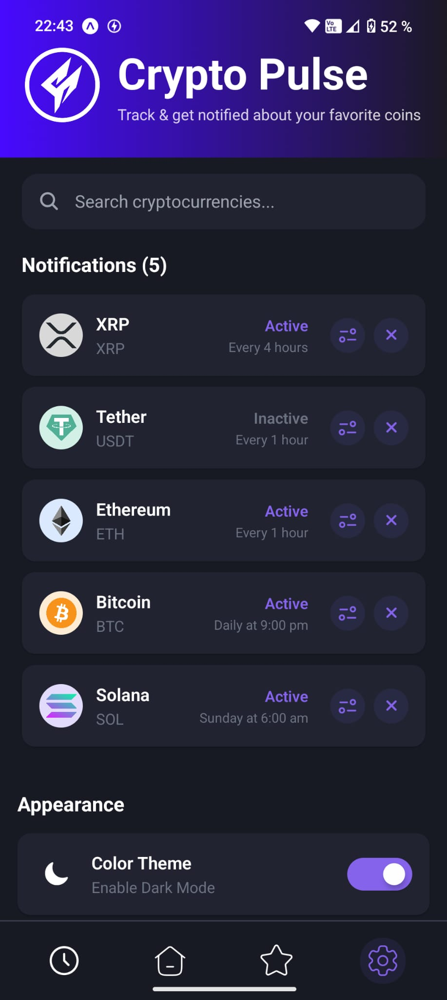
</div>

## 📱 Push Notification
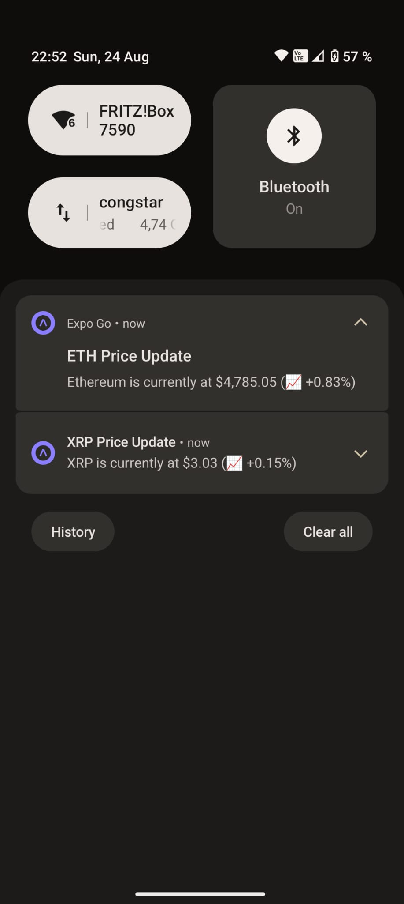

## 👨‍💻 SignIn / SignUp
<div style="display: flex; gap: 10px;">
  
  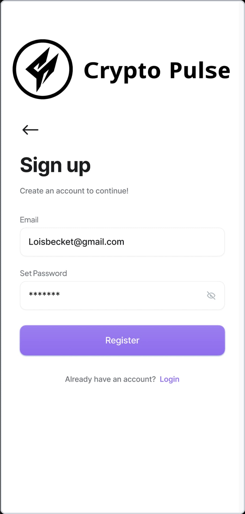
</div>
  

## ✨ Features

__📊 Live Coin Data__

- View real-time prices and percentage changes of up to 30 cryptocurrencies

- Data is fetched directly from the CoinGecko API

__⭐ Favorites Page__

- Mark your favorite coins

- Quickly access them on a dedicated page

__🔔 Custom Notifications__

- Schedule price alerts and recurring notifications.

- Flexible intervals:

  - 🗓️ Daily (e.g., every morning at 7:00)
  - 📅 Weekly (e.g., every Tuesday at 8:00)
  - ⏰ Hourly (e.g., every 8 hours)

- Edit ✏️ or delete 🗑️ existing schedules.

__📜 Notification Logs__

- Keep track of all sent alerts

- Review past notifications at any time

__🌙 Dark Mode__

- Toggle between light 🌞 and dark 🌚 themes

__🔐 User Authentication__

- Secure login 🔑 and registration powered by Supabase

## 🛠️ Tech Stack
<table>
  <tr>
    <td><strong>📱 Frontend</strong></td>
    <td>React Native (Expo), JavaScript</td>
  </tr>
  <tr>
    <td><strong>⚙️ Backend</strong></td>
    <td>Python FastAPI, RESTful APIs</td>
  </tr>
  <tr>
    <td><strong>🗄️ Database & Auth</strong></td>
    <td>Supabase (PostgreSQL + Authentication)</td>
  </tr>
  <tr>
    <td><strong>🌐 External APIs</strong></td>
    <td>CoinGecko API for cryptocurrency data</td>
  </tr>
  <tr>
    <td><strong>🔔 Notifications</strong></td>
    <td>Custom scheduler service</td>
  </tr>
</table>

## 📂 Project Structure
| 📁 Path               | 📝 Description                               |
|-----------------------|----------------------------------------------|
| `/backend/`           |Backend service built with FastAPI. Handles API, authentication, database, scheduling, and business logic.|
| `├── app/`            |Main application package containing all backend modules.|
| `│   └── /crud/`      |CRUD operations (Create, Read, Update, Delete) for database entities.|
| `│      └── __init__.py`|Package initializer.|
| `│      └── crud.py`  |Functions for interacting with database models.|
| `│   └── /models/`    |Database models (ORM).|
| `│      └── __init__.py`|Package initializer.|
| `│      └── models.py` |SQLAlchemy models for users, coins, favorites, logs, etc.|
| `│   └── /routers/`   |API route definitions.|
| `│      └── __init__.py`|Package initializer.|
| `│      └── auth.py`  |Authentication endpoints (login, signup, token validation).|
| `│      └── coins.py` |Routes to fetch coin data from CoinGecko API and to display.|
| `│      └── favorites.py` |Routes to manage user favorite coins.|
| `│      └── logs.py`  |Routes to fetch and store notification logs.|
| `│      └── notifications.py` |Routes for scheduling and managing notifications.|
| `│      └── users.py` |Routes for user management.|
| `│   └── /scheduler/`  |Background schedulers for notifications and coin price updates.|
| `│      └── notification_scheduler.py`|Handles scheduled notification jobs.|
| `│      └── price_scheduler.py` |Fetches latest coin prices at intervals.|
| `│   └── /schemas/`  |Data validation & serialization layer.|
| `│      └── __init__.py`|Package initializer.|
| `│      └── schemas.py` |Pydantic-style schemas for request/response validation.|
| `│   └── /services/`  |Business logic and integrations.|
| `│      └── price_service.py`|Service to fetch coin prices from external APIs.|
| `│      └── notification_test.py` |Script to test notification functionality.|
| `│   └── /utils/`  |Helper functions and utilities.|
| `│      └── __init__.py`|Package initializer.|
| `│      └── auth.py` |Utility functions for authentication (e.g., hashing, JWT handling).|
| `│   └── /__init__.py`  |Package initializer.|
| `│   └── /config.py`  |Application configuration (environment variables, constants).|
| `│   └── /database.py`  |Database connection and session handling.|
| `├── .env`            |Environment variables for the backend (DB connection, API keys, secrets).|
| `├── main.py`            |Entry point for the FastAPI backend (runs the server).|
| `├── requirements.txt`            |Python dependencies for the backend.|
| `├── simple_test.py`            |Simple test script for backend functionality.|
| `├── test-database.py`            |Script to test database connection and queries.|
| `/crypto-pulse/`            |React Native mobile app (Expo project).|
| `├── /assets/`  |Static assets (icons, images).|
| `├── /src/`  |Source code for the app.|
| `│   └── components/`|Reusable UI components.|
| `│      └── settings/`|Settings-related UI components.|
| `│         └── AppearanceSection.js`|Component for toggling dark/light theme.|
| `│         └── NotificationItem.js`|Component to display a single notification.|
| `│         └── NotificationSection.js`|Component to manage notification settings.|
| `│      └── BottomNav.js`|Bottom navigation bar component.|
| `│      └── CoinItem.js`|Component representing a single coin (price, % change).|
| `│      └── CoinList.js`|Component rendering a list of coins.|
| `│      └── Header.js`|App header component (title, icons).|
| `│      └── NotificationModal.js`|Modal for creating/editing notifications.|
| `│      └── SearchBar.js`|Search component to filter coins.|
| `│   └── constants/`|Static values and configuration.|
| `│      └── cryptoData.js`|Default coin data/constants.|
| `│      └── theme.js`|Theme settings (light/dark mode colors).|
| `│   └── context/`|React Context for global state.|
| `│      └── UserContext.js`|Provides user authentication state across the app.|
| `│   └── hooks/`|Custom React hooks.|
| `│      └── useCoins.js`|Hook for fetching and managing coin data.|
| `│   └── navigation/`|Navigation stack setup.|
| `│      └── AppNavigator.js`|Main navigation configuration.|
| `│      └── SwipeNavigator.js`|Navigation for swipeable views.|
| `│   └── screens/`|Screens (pages) of the app.|
| `│      └── FavScreen.js`|Screen showing user’s favorite coins.|
| `│      └── HomeScreen.js`|Main screen with live coin data.|
| `│      └── LogScreen.js`|Screen with notification logs.|
| `│      └── SettingsScreen.js`|Settings screen (theme, notifications, account).|
| `│      └── SignInScreen.js`|User login screen.|
| `│      └── SignUpScreen.js`|User registration screen.|
| `│   └── services/`|Services and API calls.|
| `│      └── api.js`|Handles communication with FastAPI backend & Supabase.|
| `│      └── pushNotifications.js`|Manages push notification logic.|
| `├── .env`  |Environment variables for the frontend (API URL, keys).|
| `├── App.js`  |Main entry point of the React Native app.|
| `├── app.json`  |Expo project configuration.|
| `├── eas.json`  |Expo Application Services configuration (build/deployment).|
| `├── index.ts`  |Entry file for TypeScript app initialization.|
| `├── package-lock.json`  |Dependency lockfile for npm.|
| `├── package.json`  |Dependencies and scripts for the frontend.|
| `├── tsconfig.json`  |TypeScript configuration.|
| `.gitignore`            |Git ignore rules.|
| `README.md`            |Project documentation.|
| `LICENSE`            |License file.|

# 🚀 Quick Start
## 🛠 Prerequisites
> [!NOTE]
> Make sure the following are installed on your system:

- 🐍 Python (v3.8 or higher)
- 🟢 Node.js(v14 or higher)
- 📱 Expo CLI
- 🗄️ Supabase account

### ⬇️ __Clone the Repository__
```
git clone https://github.com/myzra/crypto-pulse-app.git
cd crypto-pulse-app
```

### 📱 __Frontend (React Native with Expo)__
```
cd .\crypto-pulse\
npm install
npx expo start
```

### ⚙️ __Backend (FastAPI)__
```
cd .\backend\
python -m venv venv
.\venv\Scripts\Activate.ps1
pip install -r requirements.txt
uvicorn main:app --reload --host 0.0.0.0 --port 8000
```

### 🔔 __Notification Scheduler__
```
cd PATH\crypto-pulse-app\backend
>> python -m app.scheduler.notification_scheduler
```

## 🧑‍💻 Roadmap / To-Do
 - 📲 Improve notification service (push notifications instead of local scheduling)
 - 💰 Add more coins and filtering options
 - ✨ Enhance UI with animations and charts
 - 🌍 Add support for multiple languages

## 👨‍💻 Author
Created by [myzra](https://github.com/myzra) \
📜[Licensed under the MIT License](LICENSE) \
_👉 This project was built as a portfolio project to demonstrate skills in mobile development, backend integration, and cloud authentication._
